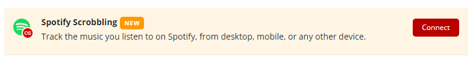

# Spotify Linking

Click the red " **Connect** " button next to Spotify Scrobbling and follow the instructions to connect your Spotify account to Last.fm.

Once connected you'll be able to scrobble wherever you use Spotify. This brings back scrobbling to Spotify's web player, and opens up the ability to scrobble from Spotify Connect devices like games consoles, TVs, smart speakers, and more.

#### Known issues

This new feature uses the Spotify api, and there are some limitations and known issues. Please read the following before connecting:

* **Scrobbling works initially, but then stops** - Please refer to [this FAQ](https://support.last.fm/t/spotify-has-stopped-scrobbling-what-can-i-do/3184) for troubleshooting.
* **Disable your existing Spotify scrobblers** - Switch off Spotify scrobbling in the Last.fm app and any other Spotify scrobblers. If you don't you might end up double scrobbling.
* **Bluetooth headphones / speakers** - When using the Last.fm android app you may need to switch off 'Other music apps' in the settings to prevent double scrobbles. This is because on some devices \(e.g. Samsung Galaxy\), streaming tracks on Spotify to a bluetooth device will be detected by the Last.fm app as a separate music player and scrobbled a second time.
* **Local files do not update "Scrobbling now"** - Scrobbling local files in Spotify is supported, however _'Scrobbling now'_ isn't updated. This means that if you mostly listen to local files on Spotify, _it can appear as if you're not scrobbling until the tracks finish playing_.
* **Offline scrobbling is limited to the last 50 tracks played** - This is due to the fact that the Spotify API only allows us to access the last 50 tracks from your play history.
* **Tracks aren't scrobbled until the adverts finish \(Spotify free\)** - This happens because the tracks you play in Spotify aren't actually scrobbled  **until the next track starts**.
* **Occasional double scrobble** - We're aware of some instances where a track you've previously scrobbled will be resubmitted to your profile at a later time by the offline scrobbler. We've fixed the vast majority of cases where this can happen, however there are still some rare edge cases where it's possible still.
* **Shared accounts / per device scrobbling is not supported** - Unfortunately it's not possible for us to support scrobbling to different Last.fm accounts. If you are unable to use separate Spotify accounts, please see the 'Other ways to scrobble from Spotify' section below.

#### Other ways to scrobble from Spotify

**Desktop**

Alternatively you can scrobble the music you listen to on the [Spotify Web Player](https://open.spotify.com/browse/featured) by using the web scrobbler browser extension:

* [Web Scrobbler for Chrome ](https://chrome.google.com/webstore/detail/web-scrobbler/hhinaapppaileiechjoiifaancjggfjm)
* [Web Scrobbler for Firefox ](https://addons.mozilla.org/en-US/firefox/addon/web-scrobbler/)
* [Web Scrobbler for other browsers ](https://web-scrobbler.github.io/) \(Opera, Vivaldi, etc\)

The primary benefit of doing this is that it allows you to _edit your scrobbles before submitting them_, which means you can correct badly formatted tags and remove redundant information from track and album titles before they're scrobbled to your profile. You can do this while still _playing_ music through the Spotify desktop app, which yields a slightly higher bitrate.

For more information how to set this up, please refer to this FAQ: _How do I do the thing?_

**Mobile \(Android\)**

Android devices have several additional options for scrobbling Spotify:

* The [Official Last.fm Android app](https://www.last.fm/about/trackmymusic#android), which you can download [here ](https://www.last.fm/about/trackmymusic#android).
* A third party scrobbling app, such as [Scroball](https://play.google.com/store/apps/details?id=com.peterjosling.scroball&hl=en_US) or [Pano Scrobbler](https://play.google.com/store/apps/details?id=com.arn.scrobble&hl=en_US).

IOS unfortunately doesn't have any alternative options that we know about yet.

